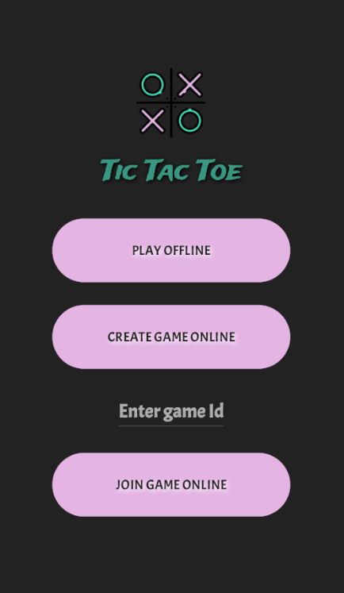
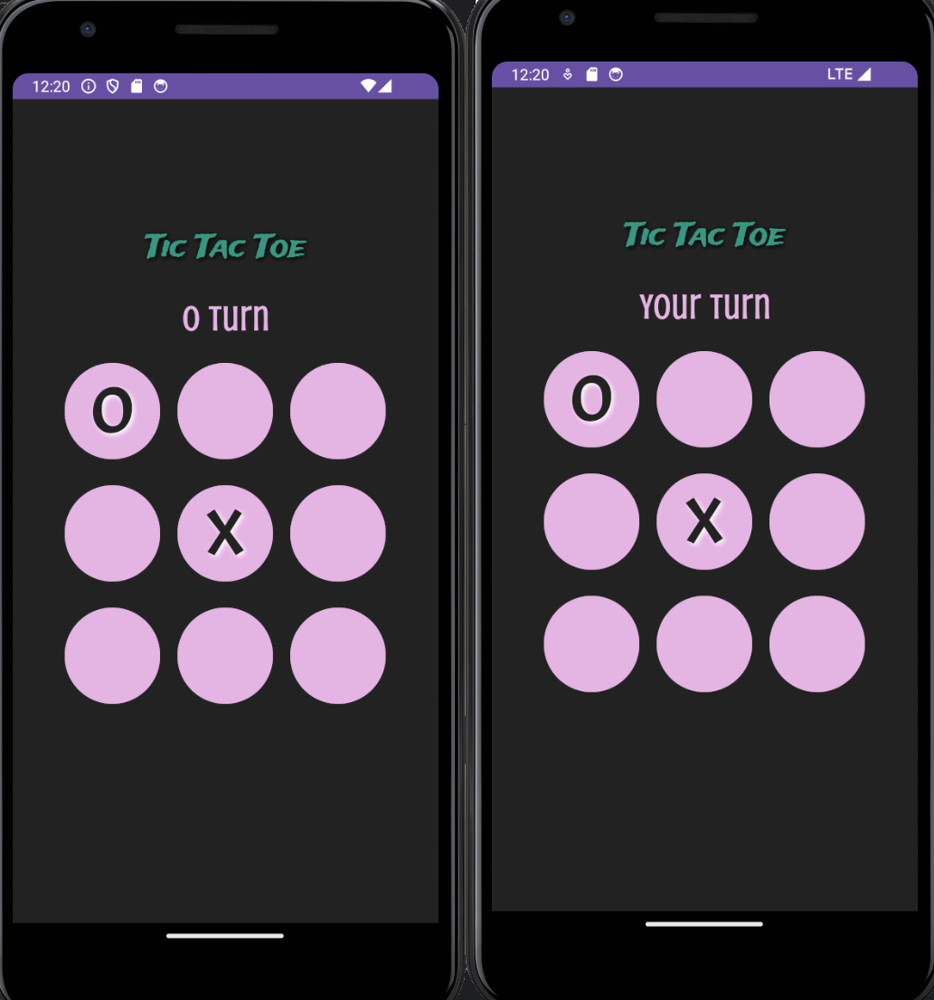

**Advanced Android-programming** 
*By Sini Kykyri, Emilia Kumpuniemi, Mikael Huotari, Topi Ilmasti *

## Tic Tac Toe App
Welcome to the Tic Tac Toe app! This simple game allows you to play the classic Tic Tac Toe game
by yourself or online with your friends.
This app is developed using Kotlin in Android Studio using Google Firestore. 

### Features
- Play by yourself
- Play against your friend by creating or joining to a game
- The game ID is automatically generated and saved to Google Firestore when starting a new online game.
- Clean and intuitive user interface

### How to Play
- Launch the app and choose whether to play by yourself or against another player 
- If you want to play with another player, press **CREATE GAME ONLINE** and give the game ID to your friend
- If you want to join to an existing game, insert game ID press **JOIN GAME ONLINE** 
- Take turns tapping on the grid to place your X or O.
- The first player to get three of their marks in a row (horizontally, vertically, or diagonally) wins the game.

 

 
  
*Home Screen*
  

*Game Screen*